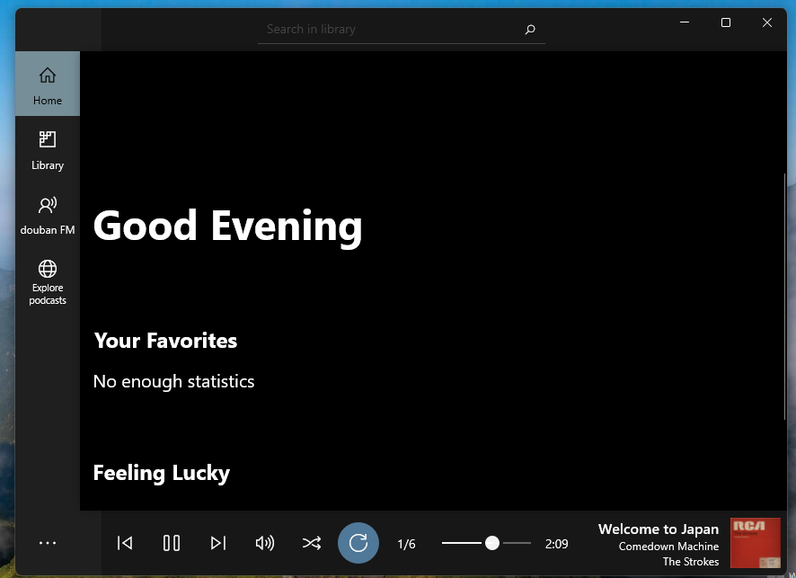
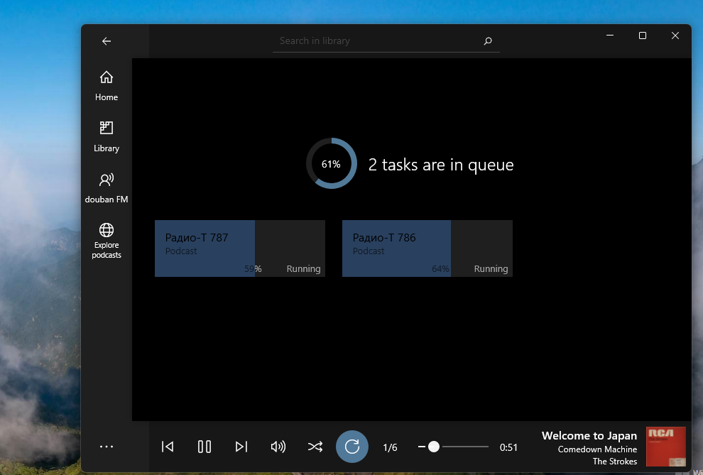
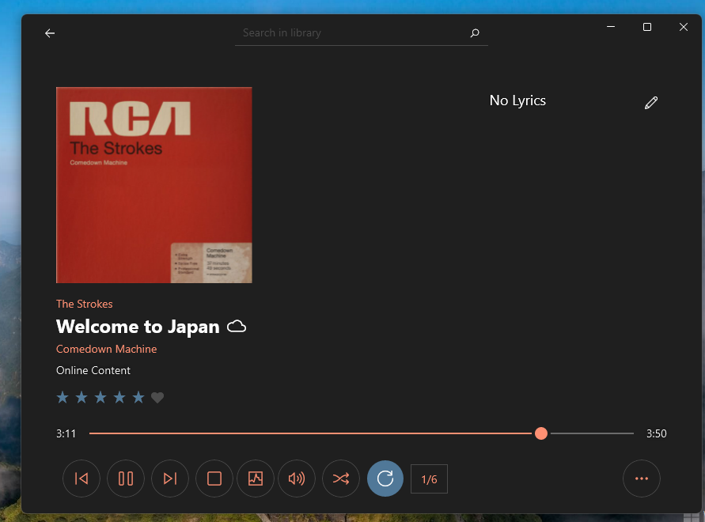

# Aurora-1

This is my fork of [Aurora Music](https://github.com/xiaosu-zhu/Aurora.Music) project.

The goal is RnD of all components (SmartFormat, etc.). Maybe, Win10Phone version appeared... idk now :)

## About

A small, lightweight UWP music player.

## Screenshots

## My 2 cents

1. Re-targeting onto Windows 10 build 15063
2. OneDrive non-main feature was hidden/disabled + the prepearing of "mobilization" started
3. Code refactoring started 

## Brief Introduction of the original

Aurora Music has been one of four finalists in **Design Innovator** of [Windows Developer Awards 2018](https://developer.microsoft.com/en-us/windows/projects/events/build/2018/awards?utm_campaign=devawards18&utm_source=devcenter&utm_medium=owned&utm_content=hero)! 🎉

## Some tech details

Aurora Music is built for a modern, fluent experience of listening music on Windows 10. It is MIT Licensed, you can fork it and build your own personalized music players.

Meanwhile, Aurora Music is extensible, we've preserved interface for lyrics, metadata and online musics. Building your extension can extend the ability of Aurora Music. We're also planning to support more advanced extensibility, such as audio effects, UI layouts, etc. Please see [To-Dos](https://github.com/pkzxs/Aurora.Music/blob/master/README.md#to-dos).

## Documents and Samples (for your own RnD/App extensions)

Please first refer to **[Something about build and deploy](./Source)**.

Please read instructions for extension development from **[here](./Documentation)**, inside there is a simple tutorial to let you make your own extension, as well as a detailed query explanation.

There's also a code sample **[here](./Samples)**, clone it and deploy, you can see what happens to lyrics.

Moreover, if you have any trouble using app, feel free to contact with [aurora.studio@outlook.com](mailto:aurora.studio@outlook.com).

## Open Source Info

You can explorer currently using open source libraries below:

| Name | License | Site |
| --- | --- | --- |
| taglib-sharp | [GNU LGPL v2.1](https://github.com/mono/taglib-sharp/blob/master/COPYING) | [github.com/mono/taglib-sharp](https://github.com/mono/taglib-sharp) |
| SQLite for Universal Windows Platform | [Public Domain](http://www.sqlite.org/copyright.html) | [sqlite.org](http://www.sqlite.org/) |
| SQLite-net | [MIT License](https://github.com/praeclarum/sqlite-net/blob/master/LICENSE.md) | [github.com/praeclarum/sqlite-net](https://github.com/praeclarum/sqlite-net) |
| UWP Community Toolkit | [MIT License](https://github.com/Microsoft/UWPCommunityToolkit/blob/master/license.md) | [github.com/Microsoft/UWPCommunityToolkit ](https://github.com/Microsoft/UWPCommunityToolkit) |
| Json.NET | [MIT License](https://github.com/JamesNK/Newtonsoft.Json/blob/master/LICENSE.md) | [newtonsoft.com](https://www.newtonsoft.com/json) |
| NAudio | [MS-PL](https://github.com/naudio/NAudio/blob/master/license.txt) | [github.com/naudio/NAudio](https://github.com/naudio/NAudio) |
| UWPAudioVisualizer | [MIT License](https://github.com/clarkezone/audiovisualizer/blob/master/LICENSE) | [github.com/clarkezone/audiovisualizer](https://github.com/clarkezone/audiovisualizer) |
| ExpressionBuilder | [MIT License](https://github.com/Microsoft/WindowsUIDevLabs/blob/master/LICENSE.txt) | [github.com/Microsoft/WindowsCompositionSamples](https://github.com/Microsoft/WindowsCompositionSamples/tree/master/ExpressionBuilder) |
| ColorThief.NET | [MIT License](https://github.com/KSemenenko/ColorThief/blob/master/LICENSE) | [github.com/KSemenenko/ColorThief](https://github.com/KSemenenko/ColorThief) |
| SmartFormat | [MIT License](https://github.com/scottrippey/SmartFormat.NET/wiki/License) | [github.com/scottrippey/SmartFormat.NET](https://github.com/scottrippey/SmartFormat.NET) |
| WriteableBitmapEx | [MIT License](https://github.com/teichgraf/WriteableBitmapEx/blob/master/LICENSE) | [github.com/teichgraf/WriteableBitmapEx/](https://github.com/teichgraf/WriteableBitmapEx/) |
| Win2D | [MIT License](https://github.com/Microsoft/Win2D/blob/master/LICENSE.txt) | [github.com/Microsoft/Win2D](https://github.com/Microsoft/Win2D) |
| LrcParser | [MIT License](https://github.com/pkzxs/Aurora.Music/blob/master/LICENSE) | [github.com/pkzxs/LrcParser](https://github.com/pkzxs/Aurora.Music/tree/master/Source/LrcParser) |

[/Source/Taglib.Sharp](./Source/TagLib.Sharp/) is ported to UWP from [mono/taglib-sharp](https://github.com/mono/taglib-sharp).

[/Source/ExpressionBuilder](./Source/ExpressionBuilder/) is from [Microsoft/WindowsCompositionSamples](https://github.com/Microsoft/WindowsCompositionSamples)

## References

- [https://github.com/xiaosu-zhu/Aurora.Music](https://github.com/xiaosu-zhu/Aurora.Music) Original Aurora Music project

## Contribute!

There's still a TON of things missing from this proof-of-concept (MVP) and areas of improvement.

With best wishes,

[m][e] 2022

Aurora-1 is RnD project only. AS-IS. No support. Distributed under the MIT License.

